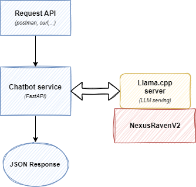

##  Overview

<p align="center">
    
</p>

I do not want to use any proprietary LLMs such as GPT-4, Claude-2,...

So I decided to come up with Open Source model and ended up with the [__NexusRavenV2__](https://nexusflow.ai/blogs/ravenv2) which is an open LLM that is even better GPT-4 in _function calling_ capability which is the final purpose of this test.

__All of this work is done at local machine from client to server side (includes LLM) and it's run on Azure VM for faster inference (8 cores + 32GB RAM) as well as hosting the 8-bit quantized NexusRavenV2 13B params.__

## Components & Miscs

### LLM
- [8 bit GGUF-based quantized model](https://huggingface.co/TheBloke/NexusRaven-V2-13B-GGUF) __(NexusRavenV2)__ from this incredible user [(@TheBlock)](https://huggingface.co/TheBloke) on the HuggingFace model hub.


### Serving
-  Prebuilt server from __llama.cpp__.


### Chatbot service
- __FastAPI__ for creating RESTful API endpoint.


### Tools
- __Postman__ for interactive API testing environment.
- __tmux__ for conventional terminal screen splitting.
- __git-lfs__ for pushing the above LLM to Github server.

## How to run?
1. Firstly, activate your virtual environment. In my case is:
```
source superbench-venv/bin/activate
```
and do not forget installing the required packages from the `requirements.txt` as below:
```
pip install -r requirements.txt
```

2. You need to download the model from HuggingFace hub using `huggingface-cli` tool:
```
huggingface-cli download TheBloke/NexusRaven-V2-13B-GGUF nexusraven-v2-13b.Q8_0.gguf --local-dir . --local-dir-use-symlinks False

```

3. Then, start the _FastAPI-based_ chatbot service with this command:
```
uvicorn server.server:chatbot_app
```

4. Finally, kick off the prebuilt _llama.cpp_ server
```
./llm/ext_lib/llama.cpp/server -ngl 32 -c 256 -m llm/models/nexusraven-v2-13b.Q8_0.gguf
```

__Voila!__, now just testing the API with your favorite tool.


## Demo
[link demo](https://drive.google.com/file/d/1FvP5gAIL-UmxMgUrXyIvauhM1eps_z-g/view?usp=sharing) (Google Drive)
